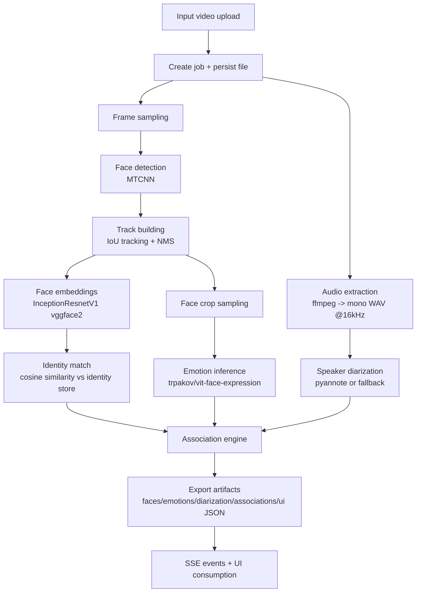

# FaceVoice Fusion — Complete Working Process

This document describes the **full end-to-end workflow** of the FaceVoice Fusion system, including:

- all pipeline stages from input to output,
- models and versions used at each stage,
- identity and speaker association logic,
- experiments/iterations and why model choices changed,
- operational fallbacks for reliability.

---

## 1) End-to-end purpose

Given an uploaded video, the system automatically:

1. extracts mono audio,
2. detects and tracks faces over time,
3. generates per-track face embeddings,
4. matches tracks against a persistent identity store,
5. infers facial emotions over time,
6. diarizes speaker turns from audio,
7. associates speaker segments to visible face tracks,
8. exports a UI-friendly JSON payload and streams live progress/events.

---

## 2) Models and versions in production

The backend exposes a `MODEL_VERSIONS` payload that captures the currently used model stack:

- **Face detector:** `facenet-pytorch-mtcnn`
- **Face embedder:** `facenet-pytorch-inceptionresnetv1`
- **Emotion model:** configurable (default `trpakov/vit-face-expression`)
- **Diarization model:** `pyannote-or-fallback`

### Detailed behavior by stage

#### Face detection + tracking
- Detector implementation: `MTCNN(keep_all=True, device="cpu")` from `facenet-pytorch`.
- Video is optionally resized before detection to control compute (`FACE_DETECT_MAX_DIM`).
- Detections are filtered by confidence (`FACE_DETECT_MIN_CONF`) and minimum box size (`FACE_DETECT_MIN_SIZE`).
- Non-maximum suppression (NMS) is applied with IoU threshold `0.4`.
- Temporal tracking is IoU-based (`> 0.3` match threshold to continue an existing track).

#### Face embeddings + identity matching
- Embedder: `InceptionResnetV1(pretrained="vggface2")`.
- Embeddings are saved as `.npy` and compared against stored vectors using cosine similarity.
- Decision thresholds:
  - `matched` if score `>= 0.55`
  - `maybe` if score `>= 0.45`
  - otherwise `unknown`

#### Emotion inference
- Inference task: Hugging Face `pipeline("image-classification")` on cropped face images.
- Default model: `trpakov/vit-face-expression`.
- Compatibility alias: if configured as `nateraw/fer`, the system transparently remaps to `trpakov/vit-face-expression`.
- Labels are normalized to a fixed schema:
  `happy, sad, anger, fear, disgust, surprise, neutral`.
- The system samples every N-th bbox (`SAMPLE_EVERY=3`) to reduce runtime and aggregates per-track dominant emotion.

#### Speaker diarization
- Primary model path: `pyannote/speaker-diarization` when `HUGGINGFACE_TOKEN` is available.
- Fallback path: if token/model/import fails, generate one low-confidence full-length segment as `S1`.
- This guarantees pipeline completion even when diarization dependencies are unavailable.

#### Speaker ↔ face association
- Association method is overlap-based:
  - for each speaker segment, find the face track with maximum timeline overlap,
  - compute confidence from overlap fraction over speaker segment duration.

---

## 3) Complete dataflow workflow diagram

---

## 4) Stage-by-stage pipeline execution order

Runtime orchestration (`run_pipeline`) executes in this order:

1. **extract_audio**
   - produces `audio.wav`.
2. **faces**
   - runs face detection/tracking and emits `track.created` events.
3. **identity**
   - computes embeddings and emits `track.identity` events.
4. **emotion**
   - computes emotion timelines and emits `track.emotion` events.
5. **diarize**
   - diarizes speakers and emits `speaker.segment` events.
6. **associate**
   - matches speakers to tracks and emits `association.updated` events.
7. **export**
   - builds UI payload (`ui.json`), marks job done, emits `job.done`.

Artifacts are stored under `data/jobs/<job_id>/` and include:
`audio.wav`, `faces_tracks.json`, `emotions.json`, `diarization.json`, `associations.json`, `ui.json`, and enriched track data.

---

## 5) Identity management lifecycle

Identity storage is persistent in `identity_store/identities.json`.

Lifecycle:

1. For each track, store an embedding at `data/jobs/<job_id>/embeddings/face/<track_id>.npy`.
2. During matching, compare against all enrolled vectors.
3. Return `matched`, `maybe`, or `unknown` with score and person metadata.
4. Human-in-the-loop enrollment (`/identity/enroll`) appends approved vectors to a named identity.
5. Later videos can auto-label the same person when similarity exceeds threshold.

This allows continuous re-identification improvements over time.

---

## 6) Experiments, iterations, and model-switch rationale

The current implementation and docs indicate several practical iterations:

### Iteration A — Emotion model compatibility adjustment
- **Initial configuration surface:** `nateraw/fer` accepted as environment value.
- **Issue observed:** model compatibility/runtime consistency was improved by converging on `trpakov/vit-face-expression`.
- **Current solution:** retain backward-compatible config (`EMOTION_MODEL_NAME=nateraw/fer`) but remap internally to `trpakov/vit-face-expression`.
- **Reason for switch:** stabilize inference behavior while preserving old deployment config contracts.

### Iteration B — Diarization robustness hardening
- **Initial expectation:** pyannote diarization available with token + package.
- **Issue observed:** environments may miss token or pyannote dependency, causing diarization failures.
- **Current solution:** automatic single-speaker fallback (`S1`) using audio duration.
- **Reason for switch/addition:** guarantee complete pipeline output instead of hard failure.

### Iteration C — Face detection quality tuning
- **Initial issue:** potential false-positive/low-quality face boxes in some videos.
- **Current mitigation:** expose `FACE_DETECT_MIN_CONF` and `FACE_DETECT_MIN_SIZE` tuning knobs; default confidence is conservative (`0.9`).
- **Reason for iteration:** improve precision and tracking stability in varied real-world inputs.

### Iteration D — Throughput optimization in emotion stage
- **Initial issue:** frame-by-frame emotion inference is computationally heavy on CPU-first deployments.
- **Current mitigation:** sample bbox timeline (`SAMPLE_EVERY=3`) while retaining temporal trend extraction.
- **Reason for iteration:** reduce runtime/cost and keep practical responsiveness.

---

## 7) Reliability and operational fallbacks

The system is intentionally designed to complete processing even in constrained environments:

- CPU-first operation for detection, embedding, and emotion inference.
- Diarization fallback when pyannote/token is unavailable.
- Emotion model load retry using candidate model list.
- Stage outputs are materialized to JSON so jobs are inspectable and recoverable.

---

## 8) Input/output contract summary

### Input
- One uploaded video file via `/upload`.

### Output
- Job status and progress metadata.
- SSE event stream for live UI.
- `ui.json` with:
  - tracks + bbox timelines,
  - identity predictions,
  - emotion timelines,
  - speaker segments,
  - speaker-track associations,
  - artifact paths and model version metadata.

---

## 9) Front-end UI technology and component descriptions

### Front-end tool/framework used
The UI is implemented as a **single-page, server-served static app** in:

- `facevoice_fusion/static/index.html`

It uses:
- **Vanilla HTML5** for structure,
- **CSS** (custom styles, no external component framework) for layout/theme,
- **Vanilla JavaScript** for behavior/state updates,
- **HTML5 `<video>` + `<canvas>` overlay** for visual playback and face box rendering,
- **SSE (Server-Sent Events)** and REST fetch calls to receive pipeline progress and artifacts.

> In short: no React/Vue/Angular; this UI is built with native browser technologies only.

### UI component breakdown

#### A) Top bar / header
- **Brand block**: title (`FaceVoice Fusion`) and subtitle that explains the feature set.
- **Upload controls**:
  - file picker for video input,
  - `Analyze` button to start processing upload.
- **Status text**: real-time job/state message while pipeline runs.
- **Date stamp**: current date display for operator context.

#### B) Main visualization area
- **Badge row**:
  - `Face Tracks` counter,
  - `Speaker Segments` counter.
- **Video container (`video-wrap`)**:
  - `<video>` element for uploaded video preview/playback,
  - `<canvas>` element layered on top for runtime drawing of:
    - tracked face boxes,
    - labels (identity + emotion + confidence).

#### C) Right side insights panel
Structured into four blocks:

1. **Pipeline Summary**
   - KPI-style summary items (face tracks, speaker segments, identities matched, emotion tracks, associations).

2. **Identities & Emotions**
   - per-track cards showing `track_id`, mapped speaker, recognized identity, dominant/current emotion and confidence.

3. **Speaker Segments**
   - ordered list of diarization segments (`speaker_id`, start/end time, confidence).

4. **Speaker ↔ Face Links**
   - association list mapping each speaker segment to the best-overlap face track with confidence indicator.

#### D) Processing timeline panel
- **Log/Activity view** (`Processing Timeline`) that appends live events and progress transitions as the backend emits updates.

### UI data flow
1. User uploads a file and starts analysis.
2. Frontend subscribes to job events and updates status/log/partial cards in near real time.
3. When finished, frontend fetches `ui.json`.
4. Panels are refreshed from final payload (`tracks`, `speakers`, `associations`).
5. During playback, canvas overlay continuously renders time-aligned face boxes and emotion labels.

## 10) Reliability troubleshooting playbook

For detailed mitigation strategies covering speech→name→face tagging edge cases (off-screen speakers, ambiguous targets, diarization/ASR noise, tracking ID switches, threshold calibration, and UI uncertainty handling), see:

- `docs/SPEECH_NAME_FACE_TAGGING_PLAYBOOK.md`

