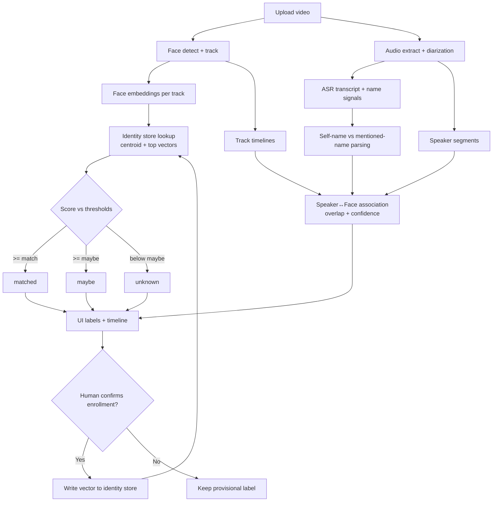

# Speech → Name → Face Tagging Reliability Playbook

This playbook maps common production failure modes to practical fixes for the current FaceVoice Fusion pipeline.

## Guiding principles

1. **Keep confidence explicit**: output `matched` / `maybe` / `unknown` rather than forcing a hard label.
2. **Fuse multiple signals**: combine diarization, mouth motion/lip activity, time overlap, and identity priors.
3. **Prefer delayed commitment**: buffer a short temporal window before assigning names.
4. **Human-in-the-loop for enrollment**: never let low-confidence auto-enrollment poison the identity store.

## Working diagram (speech → name → face → identity store)

## How the identity store works

1. **Track embedding creation**
   - For each face track (`track_id`), the pipeline saves an embedding vector in the job artifacts.

2. **Identity matching (read path)**
   - The matcher loads known identities from `identity_store/identities.json`.
   - Each person has a stable `person_id`, optional `name`, and multiple stored `face_vectors`.
   - A `face_index.centroid` is used for fast first-pass retrieval, then top candidates are refined against raw vectors.
   - Decision outputs are thresholded into `matched`, `maybe`, or `unknown` (never name by force).

3. **Remembering embeddings (provisional memory)**
   - New track vectors can be attached to a person bucket so the system keeps continuity between nearby tracks/videos.
   - This should remain provisional unless confidence and workflow policy allow confirmation.

4. **Enrollment (write path)**
   - On confirmed identity, the embedding path is appended to that `person_id` in the store.
   - If no person exists, a new `person_id` is created; if name exists, it is updated/retained.
   - Person index (`centroid`, count, updated timestamp) is rebuilt and persisted.

5. **Why mistakes persist if not controlled**
   - If a wrong enrollment is written, future nearest-neighbor matching can repeatedly return that wrong person.
   - Mitigate with human confirmation, rollback tooling, strict quality gates, and `maybe` handling.

## Issue-by-issue mitigations

### 1) Name mentioned but the person is not in the video

- Treat mention and self-identification as different event types.
- Keep `mentioned_name` on the association object but do not convert it to face identity unless visual confidence is high.
- If no plausible on-screen candidate exists, keep the name as **off-screen mention** metadata.

### 2) Multiple people visible when a single name is mentioned (ambiguous target)

- Score candidates with a weighted function:
  - temporal overlap with speaker segment,
  - speaking-face evidence (mouth motion),
  - face identity prior,
  - recent continuity with previous assignments.
- If the top two candidates are close, emit **ambiguous** and request review.

### 3) Off-screen speaker (audio speaker isn’t on camera)

- Add an `offscreen=true` state when no track reaches minimum association score.
- Preserve speaker diarization and transcript alignment, but skip face tag.

### 4) Overlapping speech / interruptions (diarization confusion)

- Use overlap-aware diarization output (multi-label speaker activity where supported).
- Segment associations at finer granularity (sub-second windows) instead of one label per long turn.

### 5) Diarization mistakes (speaker splits/merges, wrong speaker IDs)

- Add speaker embedding clustering post-pass to merge fragmented IDs.
- Add inconsistency checks (same speaker embedding appears under many IDs in short span) and auto-repair.

### 6) ASR errors for Swedish + names (mis-transcribed names, spelling variants)

- Use multilingual ASR models with Swedish support and domain adaptation when available.
- Add fuzzy name normalization (Levenshtein/phonetic matching) against known identities.
- Maintain alias dictionary: `Alex` ↔ `Alexander`, transliterations, common misspellings.

### 7) “My name is …” vs quoting/joking (false self-identification)

- Require contextual cues before accepting self-identification:
  - first-person statement near segment start,
  - repetition across turns,
  - no quotation markers/reporting verbs.
- Mark uncertain cases as `claimed_name` pending confirmation.

### 8) Mentioning others vs self-intro not distinguished reliably

- Store two separate channels:
  - `self_name_claim` (speaker about self),
  - `mentioned_name` (speaker about others).
- Never auto-enroll from `mentioned_name` alone.

### 9) Pronouns / references without names

- Add short-term coreference memory over the last N turns.
- Resolve pronouns only when one candidate is strongly dominant; otherwise leave unresolved.

### 10) Face track fragmentation (same person becomes multiple track IDs after occlusion/cuts)

- Run tracklet stitching after tracking using embedding + appearance + temporal gap constraints.
- Allow re-linking if two tracklets never overlap and are highly similar.

### 11) ID switches during tracking

- Add tracker sanity checks using motion continuity and re-ID embedding drift.
- If sudden identity jump occurs, split track and reassign segments.

### 12) Same face appears in different shots/angles/lighting (embedding mismatch)

- Use quality-weighted multi-vector identity templates (frontal/profile/lighting diversity).
- Compare against centroid plus nearest vectors, not single exemplar.

### 13) Lookalikes / family members (false matches)

- Raise match threshold for high-risk pairs and use `maybe` zone aggressively.
- Add second-factor cues when possible (voiceprint consistency, clothing continuity).

### 14) Short/blurred/profile faces (low-quality embeddings)

- Gate enrollment and matching by face quality score (size, sharpness, pose, occlusion).
- Defer identity decision until enough quality frames accumulate.

### 15) Rapid scene cuts / group shots (association timing breaks)

- Use windowed association with cut detection and reset candidate priors at hard cuts.
- In group shots, lower confidence unless speaking-face signal confirms.

### 16) Wrong label persistence (one bad enrollment causes repeated wrong labeling later)

- Enforce confirmed enrollment workflow:
  - keep auto labels provisional,
  - require human confirmation before permanent identity-store write.
- Support rollback/audit trail and vector-level deletion.

### 17) Threshold tuning issues (matched/maybe/unknown flips too often)

- Calibrate thresholds on a validation set (DET/ROC style analysis).
- Add hysteresis: higher threshold to switch identity than to keep current identity.

### 18) Multiple languages / code-switching

- Use multilingual ASR and language-ID per segment.
- Apply language-specific name parsing patterns and normalization rules.

### 19) Nicknames, diminutives, honorifics

- Store canonical identity with alias list and title stripping (`Dr.`, `Mr.`, `Ms.`).
- Resolve nickname to canonical identity only with supporting context.

### 20) Two people share same name (identity collision)

- Never key identity by name alone; key by stable `person_id`.
- Present disambiguation in UI (`name + track + confidence + thumbnail`).

### 21) Temporal mismatch (name said before/after person appears)

- Use a temporal buffer (e.g., ±5–10s) for name-to-face association.
- Decay confidence as distance from mention grows.

### 22) UI confusion (stale labels/bboxes not cleared, multiple tags overlap)

- Clear overlays each frame and expire stale labels by timestamp.
- Add collision-aware label placement and priority ordering.
- Show confidence badges and explicit `Unknown`/`Off-screen` states.

## Suggested implementation order (highest ROI first)

1. **Safety rails**: off-screen state, ambiguous state, provisional labels.
2. **Enrollment hardening**: confirmation + rollback before permanent writes.
3. **Association upgrade**: weighted multi-signal scoring + temporal buffer.
4. **Tracking robustness**: tracklet stitching and ID-switch repair.
5. **Language/name robustness**: multilingual ASR tuning + aliases/fuzzy matching.
6. **Calibration**: threshold validation and hysteresis.
7. **UI clarity**: explicit uncertainty states and overlay cleanup.

## What to monitor in production

- Name-to-face precision/recall by confidence bucket.
- Off-screen rate and ambiguous rate.
- ID switch count per hour of video.
- Enrollment reversal rate (how often humans undo automatic enrollments).
- Per-language ASR word error rate for names.

These metrics should drive threshold updates and model iteration cadence.

## Final name detection + face tagging stage

The pipeline now includes a final assignment pass (`src/name_tagging/final_name_assignment.py`) that executes after diarization/transcription and identity matching.

### Inputs
- `job_id`
- face tracks (`track_id`, time range, and bbox timeline)
- diarized + attributed transcript segments (`speaker_id`, `start/end`, `transcript_text`)
- optional active-speaker scores (ASD)
- identity store interface (`match`, `enroll`)

### Output schema (`data/jobs/<job_id>/associations.json`)
- `tracks`: final label entries per face track
  - `track_id`
  - `label` (`Name` or `Unknown`)
  - `label_source` (`identity_store`, `self_intro`, `mention`, `manual`, `none`)
  - `confidence`
  - `first_seen_ts`
  - optional metadata for maybe-candidates
- `event_log`: assignment audit trail (`self_intro`, `mention`, `match`, conflicts, unresolved events)

### Decision policy
1. **Identity store first**
   - `matched` + score above threshold → label by known identity.
   - `maybe` → UI stays `Unknown`, candidate stored as metadata only.
2. **Self-introductions** (`I'm X`, `my name is X`, `jag heter X`, `mitt namn är X`)
   - assign only to the speaking face track.
   - use ASD when available; fallback uses on-screen overlap + bbox area.
   - low-confidence cases become `unresolved_self_intro` events (no forced label).
3. **Mentioned names** (`this is X`, `det här är X`, etc.)
   - prefer non-speaker visible candidates near mention time.
   - rank by temporal presence, recent appearance, and face size.
   - unresolved/ambiguous mentions stay unassigned and are logged.
4. **Safety + persistence**
   - labels stay stable per track; higher-confidence labels win conflicts.
   - auto-enrollment is allowed only for high-confidence self-intros with enough face frames.
   - mention-based enrollment is blocked.

This stage keeps UI labels conservative and stable (`Unknown` when uncertain) while still improving cross-video recognition as self-introductions are confirmed.
